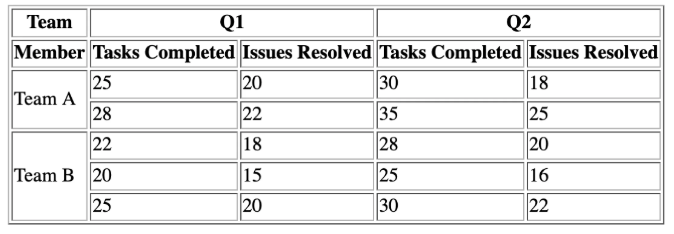
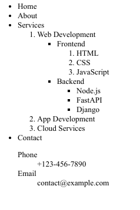

[](https://classroom.github.com/a/vH1D5PdJ)
# lab-7
This is the lab template for Lab 7 (HML + CSS)
==============================================

# HTML & CSS Activity

## Overview
This activity consists of two tasks that focus on fundamental HTML tags and building a webpage using only HTML and CSS. The structure of the activity is as follows:

```
.
|--- Expected_Output.png  # Reference output of the final webpage
|--- Expected_Output_Resposive.png # Reference output of the final webpage responsive
|--- README.md            # This file with instructions and guidelines
|--- readme-image-1.png
|--- readme-image-2.png
|--- Resources
|   |--- examples.css     # Example CSS file for reference
|   |--- examples.html    # Example HTML file for reference
|--- images               # Folder for images used in the tasks
|   |--- cloud.jpg        # image for cloud computing
|   |--- js.png           # image for JavaScript
|   |--- kubernetes.jpeg  # image for Kubernetes
|   |--- html-css.png     # image for HTML
|   |--- rest.png         # image for rest api
|--- index.html           # Main page of the final task
|--- q1.html              # Page for Task 1
|--- bonus.html           # Bonus animation task
|--- styles
    |--- styles.css       # Styles for the final webpage
```

## Task 1: Basic HTML Tags Usage (5 Marks)
In this task, you will create a webpage (`q1.html`) demonstrating the use of essential HTML elements. The following components must be included:

1. **HTML boilerplate Code**: Proper DOCTYPE declaration and initial Boilerplate Code.
2. **Table (2 Marks)**:         
    

3. **List (2 Mark)**:       
    

4. **Iframe (1 Marks)**:
   - Embed an external webpage using an `<iframe>` with link `https://www.iiit.ac.in/`.

### File Structure for Task 1:
- `q1.html` → Contains all the above components.

---

## Task 2: Replicating a Given Webpage Using Only HTML & CSS (15 Marks)
You will create a complete webpage (`index.html`) using only HTML and CSS (`styles/styles.css`), All the images are provided in the images folder. You should only use external css unless its asked to write inline.  You must **precisely** match the following specifications without making any assumptions:

### Sections and Marks Distribution:
1. **Header (4 Marks)**
   - A header with logo of heading2 on left side and menu bar on right side
   - A navigation bar with exactly four links.
     - Home - `https://www.iiit.ac.in/` in new page.
     - About - `https://sai11101989.github.io/` in same page.
     - Blog - reload (it should be active and background should be background color: `#4CAF50`)
     - Contact - it should open mail with to address as your email.
   - Background color: `#1b63a2`
   - Text color: `white`
   - Padding: `20px`
   - Links should have padding of top and bottom: `8px`; left and right: `10px` and margin of top and bottom: `0`; left and right:`5px`.
   - Active link should have a background color of `#4CAF50`.
   - Links should have a hover effect with background color : `#4CAF50` and an underline.

2. **Main Blog Section (4 Marks)**
   - A title of blog  - heading2.
   - It must contain text and an image.
   - Text must be justified with a text-indent of `40px`.
   - Images should be `250px x 180px`, `contain` in the container, and should have left margin `20px`.
   - Unordered lists should have margin of top and bottom: `10px`; left and right:`40px`.
   - FreeCodeCamp's HTML and CSS course should be a link to `https://www.freecodecamp.org/news/tag/html/` opens in same page
   - All links in the page should have underline on hover.

3. **Related Blogs Section (5 Marks)**
   - Grid layout with 2 at max in row.
   - Each blog entry should have:
     - An image (`200px x 200px`, `contain` in the container, and should have padding top and bottom: `0`;  left and right `10px`).
     - A heading (`h3`) with `margin-bottom: 15px`.
     - A justified description with a "Read More" link.
   - For screens below `1040px`, change grid to 1 item in row and remove right padding.

4. **Footer (3 Marks)**
   - Background color: `#1b63a2`
   - Text color: `white`
   - Padding top and bottom: `15px`; left and right: `20px`
   - Footer links should be `yellow` and have `text-decoration: none`.
   - Add your GitHub profile link to the link


### File Structure for Task 2:
- `index.html` → Contains the main page.
- `styles/styles.css` → Contains all CSS styling.

---

## Bonus Task: Animation (2 Mark)
Create an engaging animation using CSS. You can choose one of the following:    
- **Hover Effects**: Animate buttons, links, or images.         
- **Keyframe Animations**: Create a fading text or bouncing image effect.           
- **Transitions**: Smoothly transition elements on hover or click.      

### File for Bonus Task:
- `bonus.html` → Showcases the animation.

---

## Submission Instructions
1. Ensure all files are properly named and placed in the respective directories.
2. The expected output for Task 2 should resemble `Expected_Output.png`.
3. Submit the complete project folder in both GitHub and Moodle.

Good luck!

